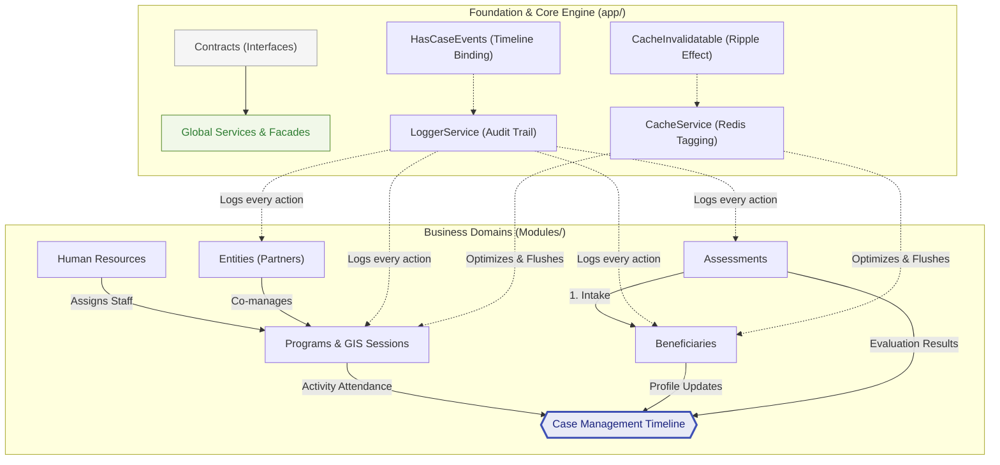

# Enterprise Resource Planning (ERP) & Case Management System - API V1
[](https://php.net/)
[](https://laravel.com)
[](https://opensource.org/licenses/MIT)
[](https://laravel.com)
## Introduction
<details>
<summary><strong>English</strong></summary>

A high-performance backend platform built with **Laravel 12**, designed to manage complex social intervention lifecycles. The system provides a seamless flow—from initial **Assessments** and **Beneficiary** registration to **Human Resources** tasking and **Program** execution. 

By utilizing a **Modular Monolith** architecture, the platform ensures strict domain separation while maintaining a centralized **Case Management** timeline for holistic data tracking and auditing of every beneficiary interaction.

</details>

<details>
<summary><strong>العربية</strong></summary>

نظام خلفي (Backend) عالي الأداء مبني باستخدام إطار عمل **Laravel 12**، مصمم لإدارة الدورات الكاملة للتدخلات الاجتماعية المعقدة. يوفر النظام تدفقاً متكاملاً للبيانات—بدءاً من **التقييمات** الأولية وتسجيل **المستفيدين**، مروراً بتكليفات **الموارد البشرية**، وصولاً إلى تنفيذ **البرامج** الميدانية.

من خلال اعتماد بنية **Modular Monolith**، يضمن النظام فصلاً صارماً بين مجالات العمل (Domains) مع الحفاظ على سجل زمني مركزي لـ **إدارة الحالات** (Case Management Timeline) لتتبع وتدقيق كافة التفاعلات مع المستفيدين بشكل شمولي.

</details>

---

## Global Architectural Blueprint

<details>
<summary><strong>English</strong></summary>

The system is engineered using a **"Core & Module"** approach. The `app/` directory provides the shared architectural framework (The Engine), while the `Modules/` directory houses the isolated business intelligence (The Domains). 

This decoupling ensures that business rules in the **Programs** or **Assessments** modules remain independent of the underlying infrastructure, while still communicating through shared **Contracts**.

</details>

<details>
<summary><strong>العربية</strong></summary>

تم هندسة النظام باستخدام منهجية **"النواة والوحدات" (Core & Module)**؛ حيث يوفر دليل `app/` الإطار الهندسي المشترك (المحرك)، بينما يحتوي دليل `Modules/` على منطق العمل المنفصل لكل مجال (النطاقات).

يضمن هذا الفصل بقاء قواعد العمل في موديولات مثل **البرامج** أو **التقييمات** مستقلة عن البنية التحتية، مع استمرار التواصل بينها عبر **عقود برمجية (Contracts)** موحدة.

</details>

### System Structure Hierarchy

| Layer | Components | Purpose |
| :--- | :--- | :--- |
| **Core Infrastructure (`app/`)** | `Contracts`, `Services`, `Facades` | The backbone: Handling Caching (Ripple Effect), Logging, and Security. |
| **Business Domains (`Modules/`)** | 7 Primary Modules | The logic: Managing Programs, Beneficiaries, and Case Timelines. |

### The Seven Pillars (Modules)

<details>
<summary><strong>English - Module Details</strong></summary>

1. **`Programs/`**: Strategic goals, Activities, GIS-enabled Sessions, and Attendance.
2. **`CaseManagement/`**: The central engine for unified timelines and event formatters.
3. **`Beneficiaries/`**: Comprehensive profiles, legal data, and history.
4. **`Assessments/`**: Diagnostic tools, intake forms, and evaluation metrics.
5. **`HumanResources/`**: Employee and trainer management.
6. **`Entities/`**: Organizational structures and partner relations.
7. **`Core/`**: Shared domain components and common utilities.

</details>

<details>
<summary><strong>العربية - تفاصيل الموديولات</strong></summary>

1. **`Programs/`**: إدارة الأهداف الاستراتيجية، الأنشطة، الجلسات المدعومة بالخرائط (GIS)، وتتبع الحضور.
2. **`CaseManagement/`**: المحرك المركزي للسجل الزمني الموحد ومنسق الأحداث (Formatters).
3. **`Beneficiaries/`**: إدارة ملفات المستفيدين الشاملة، البيانات القانونية، والتاريخ العائلي.
4. **`Assessments/`**: أدوات التشخيص، نماذج الاستقبال، ومقاييس التقييم.
5. **`HumanResources/`**: إدارة الموظفين، المدربين، وتوزيع الأدوار.
6. **`Entities/`**: إدارة الهياكل التنظيمية وعلاقات الشركاء.
7. **`Core/`**: المكونات المشتركة بين النطاقات والأدوات العامة.

</details>


---

## Project Directory Layout

```text
.
├── app/
│   ├── Contracts/          # Architectural Interfaces
│   ├── Facades/            # Custom System Facades
│   ├── Services/           # Infrastructure Layer
│   └── Http/Middleware/    # Global Security & Localization
├── Modules/
│   ├── Programs/           # Strategic Execution & Field Activities
│   ├── CaseManagement/     # Unified Timeline & Event Tracking
│   ├── Beneficiaries/      # Client Data Management
│   ├── Assessments/        # Intake & Evaluation Logic
│   ├── HumanResources/     # Staff & Trainer Orchestration
│   ├── Entities/           # Partner & Provider Management
│   └── Core/               # Shared Domain Components

```
## Key Technical Pillars (Deep Dive) | الركائز التقنية الأساسية

### 1. Advanced Tagged Caching & Ripple Effect
<details>
<summary><strong>English</strong></summary>

The project leverages a suite of advanced architectural patterns to ensure high performance and data integrity across the decoupled modules:

- **Advanced Tagged Caching & Ripple Effect**: Utilizing Redis to manage complex invalidation logic. Through the `CacheInvalidatable` contract, modifying a child record (e.g., an *Activity Session*) triggers a **Cascade Flush** (Ripple Effect) that purges related parent tags (e.g., *Program List*), preventing stale data.
- **Unified Case Timeline (Formatter Pattern)**: A centralized engine that aggregates disparate module events into a single beneficiary history. By implementing `HasCaseEvents`, models use specialized **Formatters** to transform raw data into human-readable narratives.
- **Geospatial (GIS) Intelligence**: Full integration with spatial data types (`POINT`, `LineString`) for tracking activity sessions and distribution routes with high-performance radius searching.
- **Scalable Route Orchestration**: Implementation of **Route Splitting**, where API routes are segmented into versioned files (e.g., `v1/program.php`, `v1/resource.php`) to maintain a clean and manageable entry point.
- **Transactional Service Layer**: Decoupling business logic into dedicated Services injected with a global `LoggerService` to ensure every action is audited and wrapped in database transactions for integrity.

</details>

<details>
<summary><strong>العربية</strong></summary>

يستفيد المشروع من مجموعة من الأنماط المعمارية المتقدمة لضمان الأداء العالي وسلامة البيانات عبر الموديولات المنفصلة:

- **التخزين المؤقت المتقدم وتأثير التموج (Ripple Effect)**: استخدام Redis لإدارة منطق "إبطال الكاش" المعقد. من خلال عقد `CacheInvalidatable`؛ يؤدي تعديل سجل فرعي (مثل: جلسة نشاط) إلى **تنظيف متسلسل** (Ripple Effect) يفرغ الكاش الخاص بالأصول المرتبطة (مثل: قائمة البرامج)، مما يمنع ظهور بيانات قديمة.
- **السجل الزمني الموحد (Formatter Pattern)**: محرك مركزي يجمع أحداث الموديولات المختلفة في تاريخ واحد للمستفيد. من خلال تنفيذ `HasCaseEvents`؛ تستخدم النماذج البرمجية **منسقات (Formatters)** متخصصة لتحويل البيانات الخام إلى نصوص مفهومة بشرياً.
- **الذكاء الجغرافي المكاني (GIS)**: تكامل كامل مع أنواع البيانات المكانية (`POINT`, `LineString`) لتتبع جلسات الأنشطة ومسارات التوزيع مع دعم البحث السريع في النطاقات الجغرافية.
- **تنسيق المسارات القابل للتوسع (Route Splitting)**: تطبيق استراتيجية **تقسيم المسارات**، حيث يتم فصل مسارات الـ API إلى ملفات مصنفة حسب الإصدار (مثل: `v1/program.php`) للحفاظ على كود نظيف وسهل الصيانة.
- **طبقة الخدمات العملياتية (Service Layer)**: فصل منطق العمل في خدمات مخصصة محقونة بـ `LoggerService` عالمي لضمان تدقيق كل إجراء وتغليفه داخل (Database Transactions) لضمان سلامة العمليات.

</details>

---

### 2. Case Management Timeline Integration | تكامل السجل الزمني لإدارة الحالات

<details>
<summary><strong>English</strong></summary>

A central architectural feature where disparate modules communicate with a unified beneficiary history.
- **`HasCaseEvents` Contract**: Any model across the seven modules can implement this interface to become "Timeline-aware."
- **Specialized Formatters (Decoupled Strategy)**: Unlike standard auditing, models return a **Fully Qualified Class Name (FQCN)** of a formatter. This allows the system to project complex database changes into human-readable narratives (e.g., "Beneficiary enrolled in Program X") without bloating the Model's logic.
- **Asynchronous Tracking**: Events are captured during the model's lifecycle, ensuring a complete audit trail without impacting request latency.

</details>

<details>
<summary><strong>العربية</strong></summary>

ميزة معمارية مركزية تسمح للموديولات المختلفة بالتواصل عبر سجل تاريخي موحد للمستفيد.
- **عقد `HasCaseEvents`**: يمكن لأي نموذج (Model) عبر الموديولات السبعة تنفيذ هذه الواجهة ليصبح "مدركاً للسجل الزمني".
- **المنسقات المتخصصة (استراتيجية الفصل)**: على عكس أنظمة التدقيق التقليدية، تعيد النماذج الاسم الكامل (FQCN) لفئة التنسيق. يتيح ذلك للنظام تحويل تغييرات قاعدة البيانات المعقدة إلى نصوص مفهومة (مثل: "تم تسجيل المستفيد في البرنامج X") دون تضخيم كود النموذج البرمجي.
- **التتبع غير المتزامن**: يتم التقاط الأحداث أثناء دورة حياة النموذج، مما يضمن سجل تدقيق كامل دون التأثير على سرعة استجابة الطلبات.

</details>


---

### 3. Geospatial (GIS) Intelligence | الذكاء الجغرافي المكاني

<details>
<summary><strong>English</strong></summary>

The system treats "Location" as a first-class citizen, specifically within the **Programs** and **Activities** modules.
- **Spatial Data Types**: Utilizes `POINT(latitude, longitude)` for activity sessions to ensure high-precision mapping.
- **Nearby Search**: High-performance spatial queries allow users to find sessions within a specific radius using Haversine-optimized database functions.
- **Visual Coordination**: Supports capturing and updating session coordinates via dedicated API endpoints for real-time field-level accuracy.

</details>

<details>
<summary><strong>العربية</strong></summary>

يعامل النظام "الموقع الجغرافي" كعنصر أساسي من الدرجة الأولى، خاصة ضمن موديولات **البرامج** و**الأنشطة**.
- **أنواع البيانات المكانية**: يستخدم نظام الإحداثيات `POINT(latitude, longitude)` لجلسات الأنشطة لضمان دقة خرائطية عالية.
- **البحث عن الأماكن القريبة**: تتيح الاستعلامات المكانية عالية الأداء للمستخدمين العثور على الجلسات ضمن نصف قطر محدد باستخدام وظائف قاعدة البيانات المحسنة بمعادلة "هافرسين".
- **التنسيق البصري**: يدعم التقاط وتحديث إحداثيات الجلسات عبر نقاط نهاية API مخصصة لضمان الدقة الميدانية في الوقت الفعلي.

</details>

---

### 4. Robust Service-Layer & Dependency Injection | طبقة الخدمات وحقن التبعيات

<details>
<summary><strong>English</strong></summary>

To maintain a **"Thin Controller"** approach, all complex business logic is encapsulated within a dedicated Service Layer.
- **Transactional Integrity**: Critical operations (e.g., creating a program with multiple resources) are wrapped in `DB::transaction` to ensure atomicity and prevent partial data writes.
- **DI-Driven Audit Logs**: Every service is injected with the `LoggerService` facade. This ensures that every business action is automatically logged with its full context, subject, and property changes for audit readiness.
- **Exception Handling**: Services utilize custom exceptions (like `HttpResponseException`) to enforce business rules, such as preventing invalid status transitions (e.g., moving an *Archived* program back to *Draft*).

</details>

<details>
<summary><strong>العربية</strong></summary>

للحفاظ على منهجية **"المتحكمات النحيفة" (Thin Controllers)**، يتم تغليف كافة منطق العمل المعقد داخل طبقة خدمات مخصصة.
- **سلامة العمليات (Transactions)**: يتم تغليف العمليات الحرجة (مثل إنشاء برنامج مع موارده) ضمن `DB::transaction` لضمان الذرية ومنع الكتابة الجزئية للبيانات في حال حدوث خطأ.
- **التدقيق عبر حقن التبعيات (DI)**: يتم حقن `LoggerService` في كل خدمة، مما يضمن تسجيل كل إجراء وظيفي تلقائياً مع سياقه الكامل، والموضوع، والتغييرات التي طرأت على الخصائص لأغراض التدقيق.
- **معالجة الاستثناءات**: تستخدم الخدمات استثناءات مخصصة لفرض قواعد العمل، مثل منع الانتقالات غير المنطقية لحالات البرامج (مثل محاولة إعادة برنامج "مؤرشف" إلى حالة "مسودة").

</details>


---

### 5. Globalization & Localization (Multi-Language) | العولمة وتعدد اللغات

<details>
<summary><strong>English</strong></summary>

The system is engineered for international reach with native multi-language support built into the core.
- **Dynamic Locale Switching**: The `set_locale_lang` middleware intercepts every request, setting the application language on the fly based on headers.
- **Unified Localized Responses**: All API error messages, validation rules, and system notifications are fully localized, ensuring a seamless experience for users across different regions.

</details>

<details>
<summary><strong>العربية</strong></summary>

تم هندسة النظام ليدعم الانتشار الدولي مع دعم أصيل لتعدد اللغات مدمج في النواة.
- **التبديل الديناميكي للغة**: يقوم ميدل وير `set_locale_lang` باعتراض كل طلب وتعيين لغة التطبيق فورياً بناءً على ترويسة الطلب (Header).
- **استجابات موحدة ومترجمة**: جميع رسائل خطأ الـ API، قواعد التحقق، وإشعارات النظام مترجمة بالكامل، مما يضمن تجربة مستخدم سلسة عبر مختلف المناطق الجغرافية.

</details>

| `Accept-Language` Header | Supported Language | الحالة |
| :--- | :--- | :--- |
| `ar` | Arabic | مدعوم |
| `en` | English | Supported |

---

### 6. Security & Granular Access Control | الأمن والتحكم الدقيق في الوصول

<details>
<summary><strong>English</strong></summary>

The system is designed with a **"Security-First"** mindset, essential for handling sensitive beneficiary data and organizational resources.
- **Robust Authentication (Laravel Sanctum)**: Provides secure, stateful, and token-based authentication for both SPA and Mobile clients.
- **Granular Authorization (Permission Matrix)**: Integrated with **Spatie Laravel Permission**. Access to specific resources is governed by strict Policies (e.g., `ProgramPolicy`, `BeneficiaryPolicy`), ensuring that users can only execute actions they are explicitly authorized for.
- **State-Based Locking**: Critical records (like *Completed* sessions or *Archived* programs) are logically locked at the Service layer, preventing any modifications regardless of user permissions.

</details>

<details>
<summary><strong>العربية</strong></summary>

تم تصميم النظام بعقلية **"الأمن أولاً"**، وهو أمر ضروري للتعامل مع بيانات المستفيدين الحساسة وموارد المؤسسة.
- **مصادقة قوية (Laravel Sanctum)**: يوفر مصادقة آمنة وقائمة على التوكن (Token) لكل من تطبيقات الويب (SPA) وتطبيقات الهاتف المحمول.
- **صلاحيات دقيقة (مصفوفة الأذونات)**: متكامل مع حزمة **Spatie Laravel Permission**. تخضع عملية الوصول للموارد لسياسات صارمة (Policies)، مما يضمن أن المستخدمين يمكنهم فقط تنفيذ الإجراءات المصرح لهم بها بدقة (مثل: `can:view,program`).
- **القفل المبني على الحالة**: يتم قفل السجلات الحرجة (مثل الجلسات "المكتملة" أو البرامج "المؤرشفة") برمجياً في طبقة الخدمات، مما يمنع أي تعديلات بغض النظر عن صلاحيات المستخدم.

</details>


---

### 7. Scalable Route Orchestration | تنظيم المسارات القابل للتوسع

<details>
<summary><strong>English</strong></summary>

The system employs a **Versioned Route Splitting** strategy to maintain a clean and manageable entry point.
- **Domain Segmentation**: Instead of a monolithic `api.php` file, routes are segmented by domain and version (e.g., `v1/program.php`, `v1/resource.php`).
- **Maintainability**: Ensures a clear separation between core programs and resource allocation logic, preventing namespace collisions and making the API easier to navigate for developers.
- **Lean Execution**: Only the required route files are loaded within the versioned group, optimizing the routing engine's performance.

</details>

<details>
<summary><strong>العربية</strong></summary>

يعتمد النظام استراتيجية **تقسيم المسارات حسب الإصدار** للحفاظ على نقطة دخول نظيفة وسهلة الإدارة.
- **تقسيم النطاقات**: بدلاً من ملف `api.php` واحد ومتضخم، يتم تقسيم المسارات حسب النطاق والإصدار (مثل: `v1/program.php` و `v1/resource.php`).
- **قابلية الصيانة**: يضمن فصلاً واضحاً بين البرامج الأساسية ومنطق تخصيص الموارد، مما يمنع تضارب المسميات ويجعل التنقل في الـ API أسهل للمطورين.
- **التنفيذ الرشيق**: يتم تحميل ملفات المسارات المطلوبة فقط ضمن مجموعة الإصدار المحددة، مما يحسن أداء محرك التوجيه (Routing Engine).

</details>

```text
routes/
├── api.php              # Global Entry Point
└── v1/                  # Version 1.0 Routes
    ├── program.php      # Program Lifecycle
    ├── resource.php     # Asset Allocation
    └── ...
```

## Modules Detailed Documentation | التوثيق التفصيلي للموديولات

### 1. Programs & Field Activities Module | موديول البرامج والأنشطة الميدانية

<details>
<summary><strong>English</strong></summary>

This module is the operational core of the system, responsible for strategic planning and field execution of interventions. It manages the entire journey from high-level planning to ground-level attendance.

- **Strategic Programs**: High-level containers (e.g., "Youth Empowerment 2024") that define goals and budgets.
- **Activity Execution**: Specific interventions (e.g., "Technical Training") executed through **Activity Sessions**.
- **GIS-Enabled Sessions**: Each session is bound to a `POINT` coordinate, allowing for radius-based searching and geospatial tracking of field work.
- **Resource & Budget Enforcement**: Managed via the `v1/resource.php` sub-module, ensuring that asset allocation (equipment, materials) never exceeds the predefined program budget.
- **State Machine Logic**: Programs move through a strict lifecycle (`Draft` -> `Active` -> `Completed` -> `Archived`) governed by the `ProgramService` to prevent invalid state transitions.

#### Core Business Logic:
* **Program Lifecycle & State Machine:** Programs transition through statuses (e.g., `Draft` -> `Active` -> `Completed` -> `Archived`). The `ProgramService` validates these transitions via the `ProgramStatus` Enum to prevent illogical states.
* **Spatial Session Management:** Each session is bound to a `POINT` coordinate. The system prevents scheduling conflicts and allows for radius-based searching to help beneficiaries find the nearest available sessions.
* **Resource & Budget Enforcement:** Before allocating a resource, the `ProgramResourceService` validates the remaining budget, throwing a `BudgetExceededException` if the cost exceeds the allocation.
* **The "Attendance-Timeline" Link:** When attendance is recorded, the `ActivityAttendance` model (implementing `HasCaseEvents`) automatically broadcasts the event to the **Case Management** timeline in real-time.
</details>

<details>
<summary><strong>العربية</strong></summary>

يعتبر هذا الموديول المحور التشغيلي للنظام، وهو المسؤول عن التخطيط الاستراتيجي والتنفيذ الميداني للتدخلات. يدير الموديول الدورة الكاملة بدءاً من التخطيط الكلي وصولاً إلى تسجيل الحضور الميداني.

- **البرامج الاستراتيجية**: أوعية عالية المستوى (مثل: "تمكين الشباب 2024") تحدد الأهداف والميزانيات.
- **تنفيذ الأنشطة**: تدخلات محددة (مثل: "تدريب تقني") يتم تنفيذها من خلال **جلسات الأنشطة**.
- **الجلسات المدعومة بالذكاء الجغرافي**: ترتبط كل جلسة بإحداثيات مكانية (`POINT`)، مما يسمح بالبحث بناءً على المسافة والتتبع الجغرافي للعمل الميداني.
- **ضبط الموارد والميزانية**: يتم إدارتها عبر موديول فرعي `v1/resource.php` لضمان أن تخصيص الأصول (المعدات، المواد) لا يتجاوز الميزانية المحددة للبرنامج.
- **منطق حالة النظام (State Machine)**: تنتقل البرامج عبر دورة حياة صارمة (`مسودة` -> `نشط` -> `مكتمل` -> `مؤرشف`) تدار بواسطة `ProgramService` لمنع الانتقالات غير الصالحة بين الحالات.


#### منطق العمل الأساسي:
* **دورة حياة البرنامج (State Machine):** تنتقل البرامج عبر حالات محددة (مثل: مسودة -> نشط -> مكتمل -> مؤرشف). يقوم الـ `ProgramService` بالتحقق من هذه الانتقالات عبر `ProgramStatus` Enum لمنع الحالات غير المنطقية (مثل العودة من "مؤرشف" إلى "مسودة").
* **إدارة الجلسات مكانياً:** ترتبط كل جلسة بإحداثيات مكانية (`POINT`). يمنع النظام تضارب المواعيد ويسمح بالبحث بناءً على المسافة الجغرافية لمساعدة المستفيدين في العثور على أقرب الجلسات.
* **فرض قيود الموارد والميزانية:** قبل تخصيص أي مورد (معدات أو مواد)، يتحقق `ProgramResourceService` من الميزانية المتبقية، ويقوم برمي استثناء `BudgetExceededException` إذا تجاوزت التكلفة المخصصات.
* **رابط "الحضور والسجل الزمني":** عند تسجيل الحضور، يقوم موديل `ActivityAttendance` (الذي ينفذ عقد `HasCaseEvents`) تلقائياً ببث الحدث إلى السجل الزمني لموديول **إدارة الحالات** لتحديث تاريخ المستفيد لحظياً.
</details>

---

### 2. Case Management Module | موديول إدارة الحالات

<details>
<summary><strong>English</strong></summary>

The **"Intelligence Hub"** of the system, responsible for aggregating data from all other modules into a unified, actionable view.

#### Core Business Logic:
* **Unified Timeline Engine:** Instead of querying multiple disparate tables, the timeline provides a single source of truth for a beneficiary's journey, capturing every milestone from the initial **Assessment** to the final **Attendance** record.
* **Dynamic Event Formatting (Formatter Pattern):** The system transforms raw database logs into human-readable narratives. A backend change like `program_id: 5` is automatically projected as: *"Beneficiary was enrolled in [Program Name]"*.
* **Case Sensitivity & Security:** Access to the timeline is strictly governed by `CaseManagementPolicies`, ensuring that only authorized social workers or managers can view sensitive interaction histories.

</details>

<details>
<summary><strong>العربية</strong></summary>

يُعد **"مركز الذكاء"** للنظام، وهو المسؤول عن تجميع البيانات من كافة الموديولات الأخرى وتقديمها في عرض موحد وقابل للتحليل.

#### منطق العمل الأساسي:
* **محرك السجل الزمني الموحد:** بدلاً من الاستعلام من جداول متعددة ومنفصلة، يوفر السجل الزمني مصدراً واحداً للحقيقة لرحلة المستفيد، حيث يلتقط كل محطة رئيسية بدءاً من **التقييم** الأول وصولاً إلى آخر سجل **حضور**.
* **التنسيق الديناميكي للأحداث (Formatter Pattern):** يقوم النظام بتحويل سجلات قاعدة البيانات الخام إلى سرد مفهوم بشرياً. فمثلاً، يتم تحويل تغيير تقني مثل `program_id: 5` ليظهر كالتالي: *"تم تسجيل المستفيد في برنامج [اسم البرنامج]"*.
* **خصوصية وأمن الحالات:** تخضع صلاحية الوصول للسجل الزمني لسياسات صارمة عبر `CaseManagementPolicies` لضمان أن الأخصائيين الاجتماعيين أو المديرين المصرح لهم فقط هم من يمكنهم الاطلاع على سجلات التفاعل الحساسة.

</details>


---

### 3. Beneficiaries & Assessments Module | موديول المستفيدين والتقييمات

<details>
<summary><strong>English</strong></summary>

This module manages the core **"Client Lifecycle"**, ensuring every beneficiary is accurately profiled and thoroughly evaluated before receiving services.

#### Core Business Logic:
* **Intake & Profiling:** The `BeneficiaryService` orchestrates complex profile management, including legal documentation, family tree relations, and the calculation of multi-dimensional vulnerability scores.
* **Assessment Scoring Logic:** Supports dynamic evaluation forms where each metric can have a specific weight. The system automatically calculates an overall **"Need Score"** or **"Risk Level"** to prioritize interventions.
* **Secure Document Management:** Integrated with a specialized `MediaService` to handle sensitive identity documents and assessment uploads using encrypted storage paths to ensure maximum privacy.

</details>

<details>
<summary><strong>العربية</strong></summary>

يتولى هذا الموديول إدارة **"دورة حياة العميل"** الأساسية، مما يضمن تسجيل ملف تعريف دقيق لكل مستفيد وتقييمه بشكل شامل قبل تقديم الخدمات.

#### منطق العمل الأساسي:
* **الاستقبال وتحديد الملفات الشخصية:** يقوم الـ `BeneficiaryService` بإدارة الملفات الشخصية المعقدة، بما في ذلك الوثائق القانونية، العلاقات العائلية، واحتساب درجات الهشاشة (Vulnerability Scores) متعددة الأبعاد.
* **منطق درجات التقييم:** يدعم الموديول نماذج تقييم ديناميكية حيث يمكن لكل معيار أن يمتلك وزناً محدداً. يقوم النظام تلقائياً باحتساب **"درجة الاحتياج"** الإجمالية أو **"مستوى الخطورة"** لتحديد أولويات التدخل.
* **إدارة المستندات الآمنة:** يتكامل الموديول مع خدمة `MediaService` المتخصصة للتعامل مع وثائق الهوية الحساسة ورفع ملفات التقييم باستخدام مسارات تخزين مشفرة لضمان أعلى مستويات الخصوصية.

</details>


---
### 4. Human Resources & Entities Module | موديول الموارد البشرية والكيانات الشريكة

<details>
<summary><strong>English</strong></summary>

This module manages the **"Service Providers"**—the dedicated staff and partner organizations responsible for delivering social interventions and programs.

#### Core Business Logic:
* **Skill-Based Staff Assignment:** The `HumanResources` module tracks detailed employee specializations. When scheduling an **Activity Session**, the system automatically validates that the assigned trainer or staff member possesses the required expertise for that specific `ActivityType`.
* **Entity Performance Tracking:** `Entities` (Partner Organizations) are monitored for operational efficiency. The system generates analytical reports based on the success rates, attendance metrics, and delivery quality of the activities they manage.
* **Organizational Hierarchy:** Manages the relationship between core entities and their branches, ensuring that resources and permissions flow correctly through the provider network.

</details>

<details>
<summary><strong>العربية</strong></summary>

يتولى هذا الموديول إدارة **"مزوّدي الخدمة"**—سواء كانوا من الموظفين الميدانيين أو المنظمات الشريكة المسؤولة عن تنفيذ البرامج والتدخلات الاجتماعية.

#### منطق العمل الأساسي:
* **تكليف الموظفين بناءً على المهارات:** يتتبع موديول الموارد البشرية تخصصات الموظفين بدقة. عند إنشاء **جلسة نشاط**، يتحقق النظام تلقائياً من أن المدرب أو الموظف المكلف يمتلك المهارات المطلوبة لهذا النوع المحدد من الأنشطة (`ActivityType`).
* **تتبع أداء الكيانات الشريكة:** يتم مراقبة "الكيانات" (المنظمات الشريكة) لضمان كفاءة التنفيذ. يقوم النظام بإنشاء تقارير أداء بناءً على معدلات نجاح الأنشطة، مقاييس الحضور، وجودة التنفيذ في المشاريع التي يديرونها.
* **الهيكلية التنظيمية:** يدير الموديول العلاقات بين الكيانات الكبرى وفروعها، مما يضمن تدفق الموارد والصلاحيات بشكل صحيح عبر شبكة مزودي الخدمة.

</details>


---

## API Reference & Implementation | مرجع واجهة برمجة التطبيقات

### Postman Documentation

You can access the full API collection and environment variables via the following link:
يمكنك الوصول إلى مجموعة طلبات API الكاملة ومتغيرات البيئة عبر الرابط التالي:

**[Download / View Postman Collection](https://documenter.getpostman.com/view/33882685/2sBXc7LQUa)**

---

#### Global Request Headers | ترويسات الطلب العالمية

<details>
<summary><strong>English</strong></summary>

The system follows a strict **RESTful API** design. All interactions are stateless, secured via **Laravel Sanctum**, and optimized for mobile and web frontends.

#### Global Request Headers
To ensure correct data parsing and localization, the following headers must be included in all requests:

| Header | Value | Description |
| :--- | :--- | :--- |
| `Accept` | `application/json` | Mandatory to ensure JSON responses. |
| `Authorization` | `Bearer {token}` | Your Sanctum personal access token. |
| `Accept-Language` | `en` or `ar` | Sets the locale for messages and dynamic content. |

#### Standard Response Codes
* `200 OK`: Request successful.
* `201 Created`: Resource (e.g., Beneficiary) successfully created.
* `403 Forbidden`: Insufficient permissions (Policy-level rejection).
* `422 Unprocessable Entity`: Validation failed (Localized error messages).

</details>

<details>
<summary><strong>العربية</strong></summary>

يتبع النظام تصميماً صارماً لـ **RESTful API**؛ حيث أن جميع التفاعلات غير مرتبطة بالحالة (Stateless)، ومؤمنة عبر **Laravel Sanctum**، ومحسنة لتناسب واجهات الويب وتطبيقات الهاتف.

#### ترويسات الطلب العالمية (Global Headers)
لضمان تحليل البيانات والترجمة بشكل صحيح، يجب تضمين الترويسات التالية في جميع الطلبات:

| الترويسة | القيمة | الوصف |
| :--- | :--- | :--- |
| `Accept` | `application/json` | إلزامي لضمان الحصول على استجابات بصيغة JSON. |
| `Authorization` | `Bearer {token}` | توكن الوصول الشخصي الخاص بـ Sanctum. |
| `Accept-Language` | `en` أو `ar` | يحدد لغة الرسائل والمحتوى الديناميكي. |

#### أكواد الاستجابة القياسية
* `200 OK`: تم الطلب بنجاح.
* `201 Created`: تم إنشاء المورد (مثل المستفيد) بنجاح.
* `403 Forbidden`: صلاحيات غير كافية (رفض على مستوى السياسات).
* `422 Unprocessable Entity`: فشل التحقق من البيانات (رسائل خطأ مترجمة).

</details>


---
## Installation & Setup | التثبيت والإعداد

Follow these steps to deploy the system in a development or production environment.

### Prerequisites
* **PHP 8.2+**
* **MySQL 8.0+** (Required for GIS/Spatial support) or **PostgreSQL**
* **Redis** (Mandatory for Tagged Caching & Ripple Effect)
* **Composer**

### Deployment Steps

1. **Clone the repository**:
```bash
    git clone https://github.com/Haneen-Raya/Gate_of_Hope.git
   cd Gate_of_Hope
```
2. **Install dependencies**:
```bash
   composer install
  ```
3. **Environment Setup**:
```bash
 cp .env.example .env
   php artisan key:generate
```
   *Afterward, configure your DB_* and REDIS_* settings in the .env file.*

4. **Run Database Migrations**:
   *This is a critical step that will create all ~35 tables for the application and its modules.*
```bash
   php artisan migrate
```

5. **Run Database Seeders**:
   *This will populate the database with essential data like permissions and roles.*
```bash
   php artisan db:seed
```
6. **Link Storage**:
```bash
   php artisan storage:link
```
7. **Start Redis for Caching**:
```bash
   redis-server
```
8. **Start the Application**:
```bash
   php artisan serve
```

---

## Security & Compliance | الأمن والامتثال

<details>
<summary><strong>English</strong></summary>

The system is designed with a **"Security-First"** mindset, essential for handling sensitive beneficiary data and organizational resources.

### 1. Robust Data Sanitization & Validation
* **Form Request Validation:** Every API endpoint is protected by dedicated `FormRequest` classes, ensuring strict data typing and preventing SQL injection or XSS attacks.
* **Mass Assignment Protection:** Models are strictly guarded using `$fillable` attributes to prevent unauthorized field updates.

### 2. Multi-Layered Access Control
* **Authentication (Sanctum):** Secure, stateful, and token-based authentication for both SPA and Mobile clients.
* **Granular Authorization (RBAC):** Integrated with **Spatie Laravel Permission**. Access is verified at the Policy level (e.g., `ProgramPolicy`, `BeneficiaryPolicy`).
* **State-Based Locking:** Critical records (like *Completed* sessions) are logically locked at the Service layer, preventing modifications regardless of permissions.

### 3. Comprehensive Audit Trail
* **Event Logging:** Powered by `LoggerService`, capturing every significant event (`created`, `updated`, `deleted`) with metadata including Performer ID and property changes.
* **Timeline Integrity:** The Case Management Timeline acts as a permanent ledger, ensuring accountability for every service provided.

### 4. Data Privacy & Compliance
* **GIS Privacy:** Spatial data for sessions is tracked, while sensitive beneficiary locations are handled with high-level encryption.
* **Media Security:** Documents are stored using secure, non-public disk configurations, with access granted via temporary signed URLs.

</details>

<details>
<summary><strong>العربية</strong></summary>

تم تصميم النظام بعقلية **"الأمن أولاً"**، وهو أمر جوهري للتعامل مع بيانات المستفيدين الحساسة وموارد المؤسسة.

### 1. تطهير البيانات والتحقق الصارم
* **التحقق عبر Form Request:** كل نقطة نهاية (API) محمية بفئات `FormRequest` مخصصة، مما يضمن تحديد أنواع البيانات ومنع هجمات SQL Injection أو XSS.
* **حماية التعيين الجماعي:** النماذج البرمجية محمية بدقة عبر خاصية `$fillable` لمنع تحديث الحقول غير المصرح بها.

### 2. التحكم في الوصول متعدد الطبقات
* **المصادقة (Sanctum):** توفير مصادقة آمنة وقائمة على التوكن لكل من تطبيقات الويب والجوال.
* **الصلاحيات الدقيقة (RBAC):** متكامل مع حزمة **Spatie Laravel Permission**. يتم التحقق من الوصول على مستوى السياسات (مثل: `ProgramPolicy`).
* **القفل المبني على الحالة:** يتم قفل السجلات الحرجة (مثل الجلسات "المكتملة") برمجياً في طبقة الخدمات، مما يمنع التعديل بغض النظر عن الصلاحيات.

### 3. سجل تدقيق شامل (Audit Trail)
* **تسجيل الأحداث:** يعمل بواسطة `LoggerService` لالتقاط كل حدث مهم (إنشاء، تحديث، حذف) مع بيانات وصفية تشمل معرف القائم بالإجراء وتغييرات الخصائص.
* **سلامة السجل الزمني:** يعمل السجل الزمني لإدارة الحالات كدفتر حسابات دائم، مما يضمن المساءلة عن كل خدمة مقدمة.

### 4. خصوصية البيانات والامتثال
* **خصوصية البيانات الجغرافية:** يتم تتبع البيانات المكانية للجلسات، بينما تُعالج مواقع المستفيدين الحساسة بتشفير عالٍ.
* **أمن الوسائط:** يتم تخزين المستندات المرفوعة باستخدام إعدادات أقراص غير عامة، مع منح الوصول عبر روابط مؤقتة وموقعة (Signed URLs).

</details>

---

## 📜 License & Copyright

**© 2026 Enterprise ERP System.** All rights reserved.

This software is the proprietary information of the organization. Unauthorized copying, distribution, or modification of this code via any medium is strictly prohibited.
